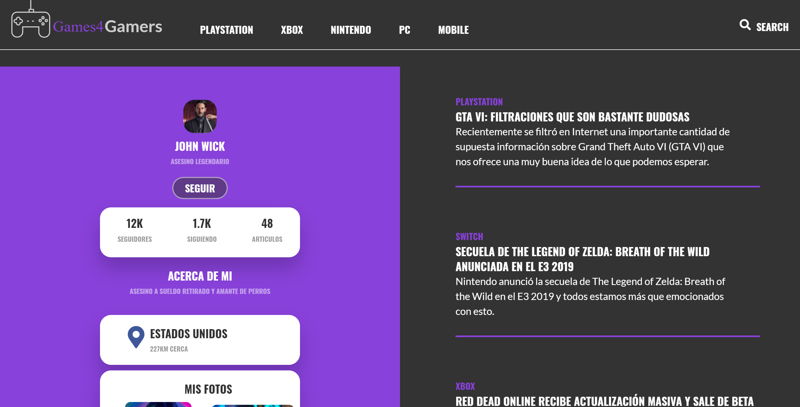
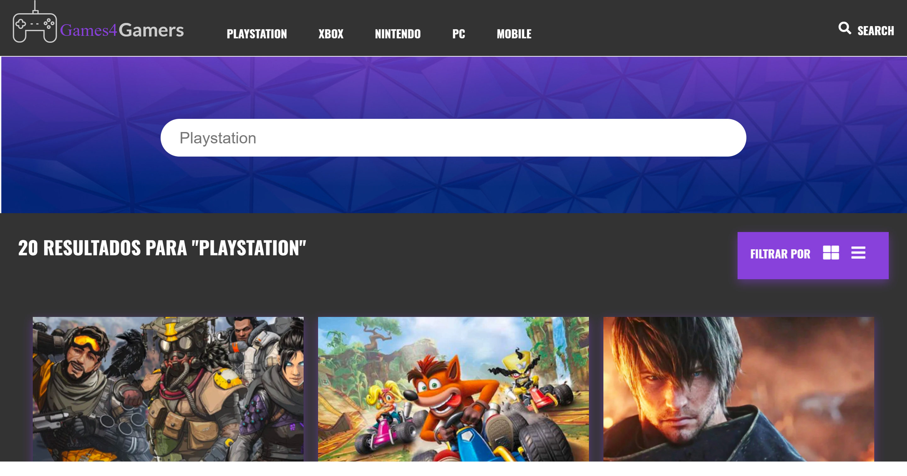

# Games4Gamers

¡Bienvenido y gracias por visitarme! Este es un proyecto elaborado como proyecto de aprendizaje del menejo de preprocesadores HTML y CSS en [Platzi](https://platzi.com/cursos/preprocesadores/) en donde aplico varios de los conocimientos y habilidades adquiridas, entre ellas:

- Implementar preprocesadores en un entorno de trabajo
- Conocer las extensiones de los preprocesadores a HTML y CSS
- Usar metodologías para estructurar código de forma óptima y modular
- Crear páginas web utilizando preprocesadores de HTML y CSS
- Insertar condicionales y variables en los estilos de una página
- Emplear funciones y mixins en un proyecto de frontend

## Preprocesadores usados

- Pug
- Sass

## Herramientas utilziadas

- Prepros

## Vista de Home

[Ver la Home](https://diegoalesco95.github.io/Games4Gamers/G4G-principal.html)

## Vista del Articulo

[Ver la Articulo](https://diegoalesco95.github.io/Games4Gamers/G4G-articulo.html)

## Vista del Perfil

[Ver la Perfil](https://diegoalesco95.github.io/Games4Gamers/G4G-perfil.html)

## Vista del Búsqueda

[Ver la Búsqueda](https://diegoalesco95.github.io/Games4Gamers/G4G-busqueda.html)

## Licencia

[MIT License](LICENSE)
